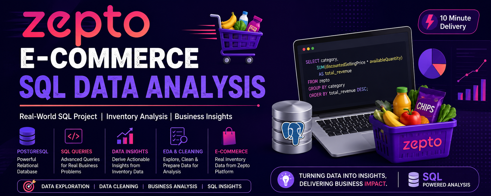

# 🛒 Zepto E-commerce SQL Data Analysis

<p align="center">
  
</p>

<p align="center">
  
  
  
  
</p>

---

# 📖 Project Overview

This project showcases a complete **SQL Data Analysis workflow** using a real-world e-commerce inventory dataset inspired by **Zepto**, one of India's fastest-growing quick-commerce companies.

The project simulates real-world responsibilities of a **Data Analyst**, including database creation, data cleaning, exploratory data analysis (EDA), and business-oriented SQL analysis.

The primary objective is to transform raw inventory data into meaningful business insights using PostgreSQL.

---

# 🎯 Objectives

- Design a relational database using PostgreSQL
- Import and validate raw inventory data
- Perform data cleaning and preprocessing
- Conduct Exploratory Data Analysis (EDA)
- Solve real-world business problems using SQL
- Generate actionable insights from inventory data
- Practice advanced SQL concepts used in industry

---

# 📊 Dataset Overview

The dataset represents inventory information from an e-commerce platform.

Each record corresponds to a unique SKU (Stock Keeping Unit).

## Dataset Columns

| Column | Description |
|---------|-------------|
| sku_id | Unique Product Identifier |
| category | Product Category |
| name | Product Name |
| mrp | Maximum Retail Price (₹) |
| discountPercent | Discount Percentage |
| discountedSellingPrice | Selling Price (₹) |
| availableQuantity | Available Inventory |
| weightInGms | Product Weight |
| outOfStock | Stock Availability |
| quantity | Package Quantity |

---

# 🛠 Tech Stack

- PostgreSQL
- SQL
- pgAdmin
- Git
- GitHub

---

# 📂 Project Structure

```text
Zepto-SQL-Data-Analysis/
│
├── dataset/
│   └── zepto_inventory.csv
│
├── sql/
│   ├── 01_database_setup.sql
│   ├── 02_data_cleaning.sql
│   ├── 03_data_exploration.sql
│   ├── 04_business_analysis.sql
│   ├── 05_views.sql
│   └── 06_indexes.sql
│
│
├── assets/
│   └── banner.png
│
├── README.md
└── LICENSE
```

---

# 🗄 Database Schema

```sql
CREATE TABLE zepto (
    sku_id SERIAL PRIMARY KEY,
    category VARCHAR(120),
    name VARCHAR(150) NOT NULL,
    mrp NUMERIC(8,2),
    discountPercent NUMERIC(5,2),
    availableQuantity INTEGER,
    discountedSellingPrice NUMERIC(8,2),
    weightInGms INTEGER,
    outOfStock BOOLEAN,
    quantity INTEGER
);
```

---

# 📥 Importing Dataset

The dataset was imported using **pgAdmin Import Tool**.

Alternatively, use PostgreSQL's `\copy` command.

```sql
\copy zepto(
category,
name,
mrp,
discountPercent,
availableQuantity,
discountedSellingPrice,
weightInGms,
outOfStock,
quantity
)
FROM 'dataset/zepto_inventory.csv'
WITH (
FORMAT csv,
HEADER true,
DELIMITER ',',
QUOTE '"',
ENCODING 'UTF8'
);
```

---

# 🔍 Exploratory Data Analysis (EDA)

The dataset was explored to answer key analytical questions.

### Data Exploration Tasks

- Count total records
- Preview dataset
- Identify NULL values
- Find duplicate products
- List all product categories
- Check stock availability
- Analyze product distribution
- Explore pricing trends
- Analyze discount distribution

---

# 🧹 Data Cleaning

Several preprocessing steps were performed before analysis.

- Removed invalid records
- Identified missing values
- Removed products with zero pricing
- Converted prices from paise to rupees
- Validated inventory quantities
- Standardized numerical values
- Checked duplicate SKUs

---

# 📊 Business Analysis

Business-focused SQL queries were written to extract meaningful insights.

## Pricing Analysis

- Top discounted products
- Premium products with low discounts
- Highest MRP products
- Average selling price by category

## Inventory Analysis

- Out-of-stock products
- Available inventory by category
- Total inventory weight
- Category-wise product count

## Revenue Analysis

- Estimated revenue by category
- Most valuable inventory
- Highest-value products

## Customer Value Analysis

- Best value products
- Price per gram
- Discount rankings
- High-value inventory items

---

# 🧠 SQL Concepts Used

## Basic SQL

- SELECT
- WHERE
- ORDER BY
- GROUP BY
- HAVING
- DISTINCT
- LIMIT

## Aggregate Functions

- COUNT()
- SUM()
- AVG()
- MAX()
- MIN()

## Conditional Logic

- CASE WHEN
- COALESCE
- NULL Handling

## Advanced SQL

- Common Table Expressions (CTEs)
- Window Functions
- RANK()
- DENSE_RANK()
- ROW_NUMBER()
- Views
- Indexes

---

# 📈 Key Business Insights

- Identified categories offering the highest average discounts.
- Calculated estimated inventory value across product categories.
- Detected premium products with minimal discounts.
- Ranked products based on price efficiency.
- Measured category-wise inventory distribution.
- Identified products providing the best value per gram.
- Analyzed stock availability across categories.
- Compared pricing trends among different product segments.

---

# 🚀 Getting Started

## 1. Clone Repository

```bash
git clone https://github.com/kunallal1/Zepto-SQL-Data-Analysis.git
```

## 2. Navigate to Project

```bash
cd Zepto-SQL-Data-Analysis
```

## 3. Create Database

```sql
CREATE DATABASE zepto_analysis;
```

## 4. Execute SQL Files

Run the SQL scripts in the following order:

```
01_database_setup.sql

02_data_cleaning.sql

03_data_exploration.sql

04_business_analysis.sql

05_views.sql

06_indexes.sql
```

## 5. Import Dataset

Import the CSV using pgAdmin or the PostgreSQL `\copy` command.

---

# 📚 Learning Outcomes

This project strengthened my understanding of:

- PostgreSQL Database Management
- SQL Query Writing
- Data Cleaning
- Data Validation
- Exploratory Data Analysis (EDA)
- Business Intelligence
- Inventory Analytics
- Retail Analytics
- Reporting with SQL
- Writing Optimized SQL Queries

---

# 🚀 Future Improvements

- Add stored procedures and functions
- Optimize queries using indexing
- Create triggers for data validation
- Automate ETL using Python
- Expand business analysis with additional KPIs
- Improve query performance analysis

---

# 📄 License

This project is licensed under the **MIT License**.

Feel free to use, modify, and share this project for learning purposes.

---

# 👨‍💻 Author

**Kunal Lal**

B.Tech Computer Science (Data Science)

Passionate about Data Analytics, SQL, Machine Learning, and solving real-world business problems through data.

---

<p align="center">
⭐ If you found this project useful, consider giving it a star on GitHub!
</p>
